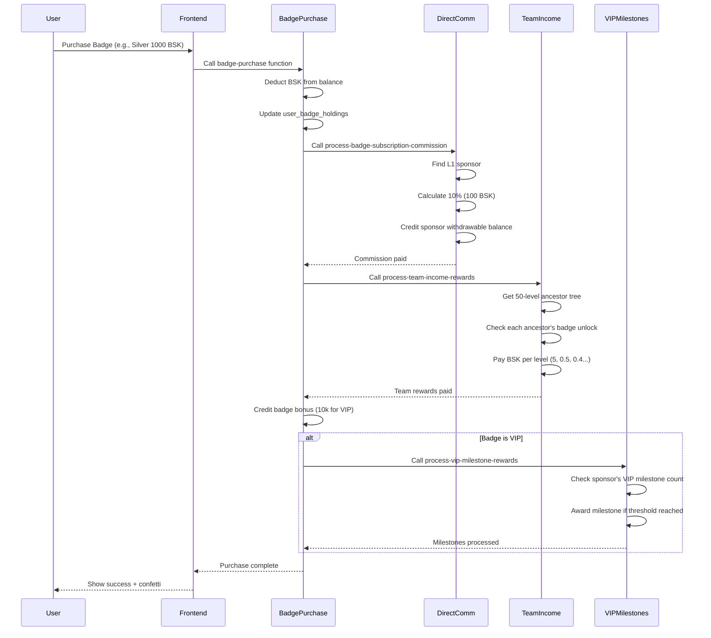

# iSmart Referral System - Complete Documentation

## 🎯 Overview

The iSmart referral system is a **50-level deep multi-tier referral network** that rewards users for building teams. It tracks referrals, calculates commissions, and manages a hierarchical tree structure.

---

## 🏗️ System Architecture

### Core Components

1. **Referral Links (`referral_links_new` table)**
   - Stores the direct sponsor relationship for each user
   - Records which referral code was used during signup
   - Locks the relationship once confirmed (prevents changes)

2. **Referral Tree (`referral_tree` table)**
   - Stores the complete upline path for each user (up to 50 levels)
   - Pre-computed for fast queries
   - Includes direct sponsor tracking at each level

3. **Referral Codes (`profiles.referral_code`)**
   - Each user gets a unique 8-character alphanumeric code
   - Can be shared via link: `https://yourapp.com/signup?ref={code}`
   - Both UUID and short codes are supported

4. **Commission System**
   - Tracks earnings in `referral_commissions` table
   - Separate holding and withdrawable balances
   - Level-based rewards configured in `referral_level_rewards`

---

## 🔄 How It Works

### 0. Referral Code System (CODE-ONLY, NO URLS)

**IMPORTANT:** The system NO LONGER uses URL-based referral capture (`/?ref=<uuid>`). All referrals must be captured via **manual code entry during signup**.

#### How Referral Codes Work:
1. **Code Format:** 8-character uppercase alphanumeric (first 8 chars of user's UUID)
2. **Signup Flow:** User must enter referral code in the "Referral Code (Optional)" field during signup
3. **Code Storage:** Entered code is stored in `localStorage` until email verification
4. **Sponsor Locking:** After email verification, sponsor is locked in `referral_links_new`
5. **Code Lookup:** System tries to find sponsor by:
   - Direct UUID match (if 36 chars entered)
   - `profiles.referral_code` match (8 chars)

#### Updated Files:
- **`src/pages/auth/SignupScreen.tsx`**: Added "Referral Code (Optional)" input field, removed URL param capture
- **`src/utils/referralCapture.ts`**: Removed URL param logic, only reads from localStorage
- **`src/hooks/useReferralCode.ts`**: Returns code only, no URL generation
- **All UI components**: Display codes instead of links (e.g., "Your Code: ABC12345")

---

### 1. User Signup Flow

```
User enters referral code during signup
    ↓
Code stored in localStorage
    ↓
User completes signup
    ↓
Email verification
    ↓
captureReferralAfterEmailVerify() runs
    ↓
System looks up sponsor by code
    ↓
Sponsor relationship locked in referral_links_new
    ↓
Referral tree built automatically
```

**Key Files:**
- `src/utils/referralCapture.ts` - Handles referral capture logic
- `src/hooks/useAuthUser.tsx` - Triggers capture on SIGNED_IN event
- `supabase/functions/build-referral-tree` - Builds tree structure

### 2. Referral Tree Structure

Each user in `referral_tree` has multiple records - one for each ancestor:

```
User A (Level 0 - Root)
  ├─ User B (Level 1 - Direct)
  │   ├─ User C (Level 2)
  │   │   └─ User D (Level 3)
```

For User D, the `referral_tree` contains:
- Record 1: ancestor = User C, level = 1, direct_sponsor = User C
- Record 2: ancestor = User B, level = 2, direct_sponsor = User C
- Record 3: ancestor = User A, level = 3, direct_sponsor = User C

### 3. Badge Purchase Commission System

**TWO SEPARATE COMMISSION SYSTEMS:**

#### A. Direct Commission (10% Badge Purchase)
**Trigger:** User purchases or upgrades a badge  
**Paid To:** DIRECT REFERRER (L1) ONLY  
**Amount:** 10% of purchase/upgrade amount  
**Destination:** Withdrawable balance  

**Examples:**
- Silver (1000 BSK) → Referrer gets **100 BSK withdrawable**
- Upgrade Silver→Gold (1000 BSK delta) → Referrer gets **100 BSK withdrawable**
- VIP (5000 BSK) → Referrer gets **500 BSK withdrawable**

**Implementation:**
- Edge Function: `process-badge-subscription-commission`
- Triggered by: `badge-purchase` function after successful purchase
- Stored in: `referral_commissions` table with `commission_type: 'badge_subscription'`
- Records in: `bonus_ledger` for audit trail

#### B. Team Income Rewards (50-Level)
**Trigger:** User purchases or upgrades a badge  
**Paid To:** ALL ANCESTORS up to 50 levels (based on their badge unlock levels)  
**Amount:** Fixed BSK per level from `referral_level_rewards` table:
- L1: 5 BSK → Holding balance
- L2-L10: 0.5 BSK each → Withdrawable
- L11-L20: 0.4 BSK each → Withdrawable
- L21-L30: 0.3 BSK each → Withdrawable
- L31-L40: 0.2 BSK each → Withdrawable
- L41-L50: 0.1 BSK each → Withdrawable

**Badge Unlock Requirements:**
- **No Badge:** Can only earn L1 (5 BSK holding)
- **Silver (1000 BSK):** Unlocks L2-L10
- **Gold (2000 BSK):** Unlocks L11-L20
- **Platinum (3000 BSK):** Unlocks L21-L30
- **Diamond (4000 BSK):** Unlocks L31-L40
- **VIP (5000 BSK):** Unlocks L41-L50

**Implementation:**
- Edge Function: `process-team-income-rewards`
- Triggered by: `badge-purchase` function after successful purchase
- Filters ancestors by their badge's `unlock_levels` value

---

### 4. Complete Badge Purchase/Upgrade Flow



**Step-by-Step:**

1. **User initiates purchase** on `/app/programs/badge-subscription`
2. **Frontend validates** BSK balance (withdrawable only)
3. **Calls** `badge-purchase` Edge Function
4. **Edge Function Process:**
   
   **Step 1:** Deduct BSK from user's balance (withdrawable first, then holding)
   
   **Step 2:** Update `user_badge_holdings` with new badge
   
   **Step 3:** Process **Direct Commission (10%)**
   - Calls `process-badge-subscription-commission`
   - Gets direct referrer from `referral_tree` WHERE `level = 1`
   - Calculates: `bsk_amount * 0.10`
   - Credits to referrer's `withdrawable_balance`
   - Records in `referral_commissions` and `bonus_ledger`
   
   **Step 4:** Process **50-Level Team Income**
   - Calls `process-team-income-rewards`
   - Gets all ancestors from `referral_tree`
   - For each ancestor, checks their badge's `unlock_levels`
   - Pays BSK from `referral_level_rewards` table
   - Credits to `holding_balance` (L1) or `withdrawable_balance` (L2-L50)
   
   **Step 5:** Credit **Badge Bonus** (if applicable)
   - VIP badge: +10,000 BSK to holding balance
   - Recorded in `bonus_ledger`
   
   **Step 6:** Process **VIP Milestones** (if VIP purchase)
   - Creates/updates `vip_milestone_tracker` for buyer
   - Checks sponsor's VIP milestone progress
   - Calls `process-vip-milestone-rewards` for sponsor
   - Awards milestone rewards if thresholds reached

5. **Return success** to frontend with bonus info
6. **Frontend displays** confetti celebration and updates balances

---

### 5. VIP Milestone System (DIRECT REFERRALS ONLY)

**IMPORTANT:** VIP milestones count **ONLY DIRECT (L1) VIP REFERRALS**.

#### Requirements:
- **Earner must be VIP:** Only VIP badge holders can earn VIP milestones
- **Counts DIRECT referrals only:** Only L1 referrals who also have VIP badge
- **Must acquire VIP AFTER referrer:** Only VIP referrals acquired after the earner got VIP count

#### Milestones:
| Direct VIP Referrals | Reward (BSK Withdrawable) |
|---------------------|---------------------------|
| 10                  | 10,000                    |
| 50                  | 50,000                    |
| 100                 | 100,000                   |
| 250                 | 200,000                   |
| 500                 | 500,000                   |

#### Implementation:
- **Edge Function:** `process-vip-milestone-rewards`
- **Triggered by:** `badge-purchase` function when new user purchases VIP
- **Tracking Table:** `vip_milestone_tracker`
- **Query Logic:** Filters `referral_tree.level = 1` AND `user_badge_holdings.current_badge = 'i-Smart VIP'`
- **Records in:** `referral_commissions`, `user_bsk_balances`, `bonus_ledger`

#### Query Example:
```sql
SELECT COUNT(*)
FROM referral_tree rt
JOIN user_badge_holdings ubh ON rt.user_id = ubh.user_id
WHERE rt.ancestor_id = {sponsor_id}
  AND rt.level = 1
  AND ubh.current_badge = 'i-Smart VIP'
  AND ubh.purchased_at > {sponsor_vip_acquired_at}
```

---

## 🛠️ Admin Tools

### 1. Complete System Repair Tool (NEW! ⭐)

**Location:** `/admin/tree-health` (top of page)

**What it does:**
- ✅ Creates missing `referral_links_new` records for all users
- ✅ Resolves and locks users with `sponsor_code_used` but no locked sponsor
- ✅ Automatically rebuilds all referral trees
- ✅ One-click fix for entire system

**When to use:**
- After discovering users with unlocked referrals
- When tree structure seems incorrect
- After manual database changes
- As part of system maintenance

### 2. Referral Backfill Tool

**What it does:**
- Scans for users with unlocked sponsors
- Allows manual sponsor assignment
- Batch backfill operation

### 3. Tree Rebuild Tools

- **Single User:** Rebuilds tree for one user
- **All Trees:** Force rebuilds all trees (preserves existing relationships)

---

## 📊 Key Database Tables

### `referral_links_new`
```sql
user_id          UUID (PK)
sponsor_id       UUID (FK → profiles.user_id)
sponsor_code_used TEXT
locked_at        TIMESTAMP
lock_stage       TEXT
```

### `referral_tree`
```sql
user_id          UUID (PK, part of composite)
ancestor_id      UUID (PK, part of composite)
level            INTEGER
path             TEXT[]
direct_sponsor_id UUID
```

### `referral_commissions`
```sql
id               UUID (PK)
sponsor_id       UUID (FK → profiles.user_id)
referee_id       UUID (FK → profiles.user_id)
amount           NUMERIC
level            INTEGER
action_type      TEXT
status           TEXT (pending/settled)
```

### `referral_level_rewards`
```sql
level            INTEGER (PK)
reward_amount    NUMERIC
is_holding       BOOLEAN
badge_required   TEXT
enabled          BOOLEAN
```

---

## 🚀 Features

### Current Features
- ✅ 50-level deep referral tree
- ✅ Automatic tree building on signup
- ✅ Short referral codes (8 chars)
- ✅ UUID support for backwards compatibility
- ✅ Commission tracking (holding + withdrawable)
- ✅ Badge-based level unlocking
- ✅ Self-referral blocking
- ✅ Admin repair tools
- ✅ Tree health monitoring
- ✅ Orphan node detection
- ✅ Direct referral count
- ✅ Downline tree viewer with search/filter
- ✅ VIP milestone tracking

### UI Components
- `TeamReferralsDashboard` - Main user dashboard
- `ReferralTreeView` - Visual tree display
- `DirectReferralsList` - Shows direct team
- `DownlineTreeViewer` - Multi-level view
- `ReferralCommissionHistory` - Earnings log
- `SponsorInfoCard` - Shows upline info

---

## 🔧 Common Issues & Solutions

### Issue: User shows fewer referrals than expected

**Cause:** Referral relationship was never locked during signup

**Solution:**
1. Go to `/admin/tree-health`
2. Click "Repair Complete System" button
3. System will automatically:
   - Find all users with unlocked sponsors
   - Resolve their referral codes
   - Lock the relationships
   - Rebuild all trees

### Issue: Referral tree showing orphan nodes

**Cause:** Missing parent records in tree structure

**Solution:**
1. Click "Force Rebuild All Trees" in Tree Health dashboard
2. This rebuilds trees for all users with locked sponsors

### Issue: User didn't get commission for referral

**Cause:** Could be multiple reasons:
- Sponsor badge requirements not met
- Referral tree not built
- Commission settings disabled for that level

**Solution:**
1. Check `user_badge_holdings` for sponsor
2. Check `referral_tree` exists for referee
3. Check `referral_level_rewards` for that level
4. Check `referral_commissions` table for record

---

## 🎨 User Experience Flow

### For Referrers:
1. Get unique referral code from "Team Referrals" page
2. Share code via copy/paste or share button
3. View direct referrals in "Direct" tab
4. View entire downline in "Downline" tab (up to 50 levels)
5. Track commissions in "Commissions" tab
6. See progress toward VIP milestones

### For Referees:
1. Click referral link (or enter code at signup)
2. Complete signup and email verification
3. Sponsor automatically locked
4. Become part of sponsor's downline
5. Can build own downline using their code

---

## 📈 Analytics & Tracking

### Available Metrics:
- Total direct referrals
- Total downline size (all levels)
- Total BSK earned from referrals
- Active vs inactive referrals
- VIP referrals count
- Level distribution
- Commission history

### Hooks Available:
- `useDirectReferralCount()` - Count direct referrals
- `useDirectReferrals()` - Full direct referral data
- `useDownlineTree()` - Complete downline structure
- `useSponsorInfo()` - Upline information
- `useReferralCode()` - Current user's code

---

## 🔐 Security Features

1. **Self-Referral Blocking:** Users cannot use their own code
2. **Lock-Once Policy:** Sponsor cannot be changed after locking
3. **Admin-Only Tools:** Tree repair requires admin role
4. **Email Verification Required:** Referrals lock only after email confirmed
5. **Code Validation:** Invalid codes rejected at signup

---

## 🚀 Latest Improvements (2025)

### January 2025
- ✅ Created comprehensive system repair tool
- ✅ Automatic backfill for unlocked referrals
- ✅ One-click tree rebuild for all users
- ✅ Enhanced admin dashboard
- ✅ Improved error handling in capture flow
- ✅ Better logging for debugging

### Key Fixes
- Fixed missing `referral_links_new` records on signup
- Fixed sponsor resolution for short codes
- Fixed tree rebuild for edge cases
- Improved performance for large trees

---

## 📞 For Developers

### Testing Referrals Locally:
1. Create two test accounts
2. Get referral code from Account A
3. Sign up Account B with `?ref={code}` in URL
4. Verify Account B's email
5. Check `referral_links_new` for locked relationship
6. Check `referral_tree` for ancestor records

### Edge Functions:
- `admin-repair-referral-system` - Complete system repair
- `admin-rebuild-all-trees` - Rebuild all trees
- `admin-rebuild-referral-trees` - Rebuild single tree
- `build-referral-tree` - Build tree for new user
- `process-badge-subscription-commission` - 10% direct commission on badge purchases
- `process-team-income-rewards` - 50-level team income distribution
- `process-vip-milestone-rewards` - VIP milestone rewards (direct referrals only)
- `process-signup-commissions` - Handle signup bonuses

---

## 📝 Summary

The iSmart referral system is now **fully automated** with comprehensive admin tools. The new **Complete System Repair Tool** ensures that all referral relationships are correctly locked and trees are properly built.

**Current Status:**
- ✅ Referral capture working on signup
- ✅ Tree building automatic
- ✅ Commission distribution functional
- ✅ Admin tools available for any edge cases
- ✅ 50-level depth supported
- ✅ Visual tree explorer for users

**Next Steps for Admins:**
1. Run the "Repair Complete System" tool once to fix any historical data
2. Monitor tree health dashboard periodically
3. System should self-maintain going forward

---

## 💡 Key Differences from Previous System

### What Changed:
1. **❌ Removed:** URL-based referral links (`/?ref=<uuid>`)
2. **✅ Added:** Manual referral code entry during signup
3. **✅ Added:** 10% direct commission on badge purchases (L1 only)
4. **✅ Clarified:** Two separate commission systems (direct vs. team income)
5. **✅ Enhanced:** VIP milestone tracking (direct referrals only)
6. **✅ Improved:** Badge upgrade logic (pays commission on delta amount)

### What Stayed the Same:
- ✅ 50-level referral tree structure
- ✅ Team income rewards per level (5, 0.5, 0.4, 0.3, 0.2, 0.1 BSK)
- ✅ Badge unlock system for level access
- ✅ VIP milestone thresholds (10, 50, 100, 250, 500)
- ✅ Holding vs. withdrawable balance separation
- ✅ Admin repair and management tools

---

*Last Updated: January 2025*
*Version: 3.0 - Code-Only Referral System*
