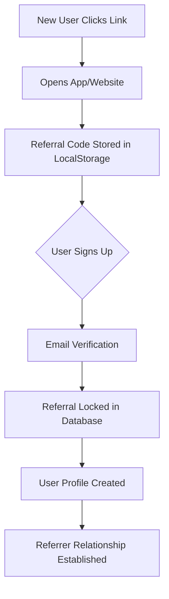

# 🎯 Referral System Complete Guide

## Overview

Your I-SMART Exchange app has a comprehensive multi-level referral system with badge-based rewards. Here's how everything works:

---

## 📱 How Referral Links Work

### 1. **Referral Link Generation**

Each user gets a unique referral link in the format:
```
https://i-smartapp.com/r/{CODE}
```

**Code Sources (Priority Order):**
1. `profiles.referral_code` - Stored in database
2. `profiles.username` - Extracted from email
3. `user.id` - User's unique ID as fallback

**Example Links:**
- `https://i-smartapp.com/r/JOHN123`
- `https://i-smartapp.com/r/user@email.com` (username extracted)
- `https://i-smartapp.com/r/550e8400...` (user ID)

### 2. **Link Sharing (Native APK)**

When users tap "Share" button in the app:
- **APK**: Opens Android native share dialog
- **Options**: WhatsApp, Telegram, SMS, Email, etc.
- **Auto-formatted**: Title + Message + Link included

```typescript
// Native Share Implementation
await Share.share({
  title: 'Join me on I-SMART Exchange',
  text: 'Start trading crypto and earning rewards!',
  url: referralLink,
  dialogTitle: 'Share Referral Link'
});
```

### 3. **Referral Capture Flow**



**Step-by-Step:**

1. **First Touch** (User clicks referral link)
   - Referral code captured from URL: `/r/{CODE}`
   - Stored in `localStorage` as `ismart_pending_ref`
   - Valid for 30 days
   - Includes: code, sponsor_id, timestamp

2. **Sign Up** (User creates account)
   - Pending referral remains in localStorage
   - Not yet locked (user can change their mind)

3. **Email Verification** (User confirms email)
   - Referral is **locked** permanently
   - Inserted into `referral_links_new` table
   - Creates entry in `referral_relationships` table
   - Sponsor-Referee connection established

4. **After Lock**
   - Referrer earns commissions on referee's activities
   - Multi-level tracking activated
   - Badge-based unlocking starts

---

## 🏆 Badge-Based Multi-Level System

### Badge Tiers

| Badge | BSK Cost | Unlocked Levels | Bonus BSK Holding |
|-------|----------|-----------------|-------------------|
| **Silver** | 1,000 BSK | 10 levels | 0 |
| **Gold** | 2,000 BSK | 20 levels | 0 |
| **Platinum** | 3,000 BSK | 30 levels | 0 |
| **Diamond** | 4,000 BSK | 40 levels | 0 |
| **i-Smart VIP** | 5,000 BSK | 50 levels | 10,000 BSK |

### How Badge Levels Work

**Example: Gold Badge Holder**
- Can earn commissions from 20 levels down
- Direct referral = Level 1
- Referral's referral = Level 2
- ...and so on to Level 20

**Without Badge:**
- Only earns from direct referrals (Level 1)
- No multi-level earnings

### Commission Structure

**Direct Referral Rewards:**
- 10% commission on badge purchases/upgrades by direct referrals
- Paid in BSK tokens
- Goes to `withdrawable_balance`

**Multi-Level Team Rewards:**
- Earn from all levels unlocked by your badge
- Based on `team_referral_settings` configuration
- Tracks through `referral_events` table

---

## 👥 Database Tables Explained

### Key Tables

#### 1. **`profiles`**
```sql
- user_id (UUID) - Unique user identifier
- username (TEXT) - Extracted from email
- referral_code (TEXT) - Unique referral code
- email (TEXT)
- full_name (TEXT)
```
**Purpose:** Stores user information and referral codes

#### 2. **`referral_relationships`**
```sql
- id (UUID)
- referrer_id (UUID) - The person who referred
- referee_id (UUID) - The person who signed up
- created_at (TIMESTAMP)
```
**Purpose:** Tracks who referred whom (simple parent-child)

#### 3. **`referral_links_new`**
```sql
- user_id (UUID) - The referee
- sponsor_id (UUID) - The referrer
- referral_code (TEXT) - Code used
- locked_at (TIMESTAMP) - When relationship locked
- first_touch_at (TIMESTAMP) - First click
- source (TEXT) - applink, web, etc.
- capture_stage (TEXT) - after_email_verify
```
**Purpose:** Detailed referral tracking with timestamps

#### 4. **`referral_events`**
```sql
- user_id (UUID) - Who took the action
- referrer_id (UUID) - Who earned the commission
- level (INTEGER) - How many levels deep
- amount_bonus (NUMERIC) - BSK reward amount
- usd_value (NUMERIC) - USD equivalent
- action (TEXT) - Type of qualifying action
- tx_status (TEXT) - completed/pending
```
**Purpose:** Logs every commission earned

#### 5. **`badge_thresholds`**
```sql
- badge_name (TEXT) - Silver, Gold, etc.
- bsk_threshold (NUMERIC) - Cost to purchase
- unlock_levels (INTEGER) - How many levels unlocked
- bonus_bsk_holding (NUMERIC) - Bonus BSK credited
- is_active (BOOLEAN)
```
**Purpose:** Defines badge pricing and benefits

#### 6. **`team_referral_settings`**
```sql
- enabled (BOOLEAN) - System on/off
- direct_referral_percent (NUMERIC) - 10%
- min_referrer_badge_required (TEXT) - ANY_BADGE
- commission_scope (TEXT) - BADGE_PURCHASES_AND_UPGRADES
- payout_destination (TEXT) - WITHDRAWABLE
- cooloff_hours (INTEGER) - 24
- max_daily_direct_commission_bsk (NUMERIC) - 100,000
```
**Purpose:** Global settings for the entire referral system

---

## 🎮 Admin Controls

### 1. **Team Referral Settings** (Database Table)

Admins can control everything through the `team_referral_settings` table:

```sql
-- Enable/Disable entire system
UPDATE team_referral_settings SET enabled = true;

-- Change commission percentage
UPDATE team_referral_settings SET direct_referral_percent = 15;

-- Set minimum badge requirement
UPDATE team_referral_settings 
SET min_referrer_badge_required = 'GOLD';

-- Cap daily commissions
UPDATE team_referral_settings 
SET max_daily_direct_commission_bsk = 50000;

-- Change payout destination
UPDATE team_referral_settings 
SET payout_destination = 'HOLDING'; -- or 'WITHDRAWABLE'
```

### 2. **Badge Management** (badge_thresholds)

```sql
-- Update badge costs
UPDATE badge_thresholds 
SET bsk_threshold = 1500 
WHERE badge_name = 'Silver';

-- Change unlocked levels
UPDATE badge_thresholds 
SET unlock_levels = 15 
WHERE badge_name = 'Gold';

-- Disable a badge tier
UPDATE badge_thresholds 
SET is_active = false 
WHERE badge_name = 'Platinum';

-- Add bonus BSK holding
UPDATE badge_thresholds 
SET bonus_bsk_holding = 5000 
WHERE badge_name = 'Diamond';
```

### 3. **Referral Events** (Monitor & Adjust)

```sql
-- View all referral commissions
SELECT * FROM referral_events 
ORDER BY created_at DESC 
LIMIT 100;

-- Top referrers by earnings
SELECT 
  referrer_id,
  SUM(amount_bonus) as total_bsk_earned,
  COUNT(*) as total_events
FROM referral_events
GROUP BY referrer_id
ORDER BY total_bsk_earned DESC;

-- Daily commission totals
SELECT 
  DATE(created_at) as date,
  SUM(amount_bonus) as daily_bsk_paid
FROM referral_events
GROUP BY DATE(created_at)
ORDER BY date DESC;
```

### 4. **User Management**

```sql
-- View user's referral network
SELECT 
  rr.referee_id,
  p.username,
  p.email,
  rr.created_at
FROM referral_relationships rr
JOIN profiles p ON rr.referee_id = p.user_id
WHERE rr.referrer_id = 'USER_ID_HERE'
ORDER BY rr.created_at DESC;

-- Check user's badge status
SELECT * FROM user_badge_holdings 
WHERE user_id = 'USER_ID_HERE';

-- Total team size by levels
WITH RECURSIVE team_tree AS (
  -- Direct referrals (Level 1)
  SELECT referee_id, 1 as level
  FROM referral_relationships
  WHERE referrer_id = 'USER_ID_HERE'
  
  UNION ALL
  
  -- Recursive referrals (Level 2+)
  SELECT rr.referee_id, tt.level + 1
  FROM referral_relationships rr
  JOIN team_tree tt ON rr.referrer_id = tt.referee_id
  WHERE tt.level < 50
)
SELECT level, COUNT(*) as users
FROM team_tree
GROUP BY level
ORDER BY level;
```

### 5. **Balance Management**

```sql
-- View user BSK balances
SELECT * FROM user_bsk_balances 
WHERE user_id = 'USER_ID_HERE';

-- Adjust user balance (admin only)
INSERT INTO bsk_withdrawable_ledger (
  user_id, amount_bsk, tx_type, notes
) VALUES (
  'USER_ID', 500, 'admin_adjustment', 'Referral bonus correction'
);

-- Update balance
UPDATE user_bsk_balances 
SET withdrawable_balance = withdrawable_balance + 500
WHERE user_id = 'USER_ID';
```

---

## 🔐 Admin Access & Roles

### Admin Role Check

```sql
-- Check if user is admin
SELECT * FROM user_roles 
WHERE user_id = 'USER_ID' 
AND role = 'admin';

-- Grant admin role
INSERT INTO user_roles (user_id, role, assigned_by)
VALUES ('USER_ID', 'admin', auth.uid())
ON CONFLICT DO NOTHING;

-- Revoke admin role
DELETE FROM user_roles 
WHERE user_id = 'USER_ID' 
AND role = 'admin';
```

### Row-Level Security (RLS) Policies

**Team Referral Settings:**
- ✅ **Admins**: Full control (ALL operations)
- ✅ **Users**: Read-only access (SELECT only)

**Referral Events:**
- ✅ **Admins**: View all events
- ✅ **Users**: View only their own events (as referrer or referee)
- ✅ **System**: Can create events (automated)

**Badge Thresholds:**
- ✅ **Admins**: Full management
- ✅ **Users**: View active badges only

---

## 🚀 Real-World Example Flow

### Scenario: John refers Mary, Mary refers Bob

1. **John's Action:**
   - Shares link: `https://i-smartapp.com/r/JOHN123`
   - Via WhatsApp to Mary

2. **Mary Clicks & Signs Up:**
   - Link opens app
   - `JOHN123` stored in localStorage
   - Mary creates account → verifies email
   - **Referral locked:**
     - `referral_relationships`: `referrer_id=John, referee_id=Mary`
     - `referral_links_new`: `user_id=Mary, sponsor_id=John`

3. **Mary Buys Gold Badge (2000 BSK):**
   - **John earns**: 200 BSK (10% of 2000)
   - **Inserted**: `referral_events` (referrer_id=John, level=1, amount_bonus=200)
   - **Credited**: John's `user_bsk_balances.withdrawable_balance += 200`
   - **John's status**: Can now earn from 20 levels (Gold badge unlocks)

4. **Mary Shares Her Link:**
   - `https://i-smartapp.com/r/MARY456`
   - Bob clicks → signs up → verifies

5. **Bob Buys Silver Badge (1000 BSK):**
   - **Mary earns**: 100 BSK (direct referral, level 1)
   - **John earns**: Commission from level 2 (if his badge allows)
   - **Both recorded** in `referral_events`

6. **Admin View:**
```sql
-- See the entire tree
SELECT rr.*, 
  p1.username as referrer_name,
  p2.username as referee_name
FROM referral_relationships rr
JOIN profiles p1 ON rr.referrer_id = p1.user_id
JOIN profiles p2 ON rr.referee_id = p2.user_id
WHERE rr.referrer_id IN ('John_ID', 'Mary_ID');

Result:
referrer_name | referee_name | created_at
--------------|--------------|-----------
john123       | mary456      | 2025-01-01
mary456       | bob789       | 2025-01-02
```

---

## 📊 Monitoring & Reports

### Key Metrics for Admins

**1. Total Referral Stats:**
```sql
SELECT 
  COUNT(DISTINCT referrer_id) as total_referrers,
  COUNT(DISTINCT user_id) as total_referees,
  SUM(amount_bonus) as total_bsk_paid,
  SUM(usd_value) as total_usd_value
FROM referral_events;
```

**2. Active Referrers (Last 30 Days):**
```sql
SELECT 
  p.username,
  COUNT(*) as referrals_last_30d,
  SUM(re.amount_bonus) as bsk_earned
FROM referral_events re
JOIN profiles p ON re.referrer_id = p.user_id
WHERE re.created_at > NOW() - INTERVAL '30 days'
GROUP BY p.username
ORDER BY bsk_earned DESC
LIMIT 20;
```

**3. Badge Purchase Rates:**
```sql
SELECT 
  bt.badge_name,
  COUNT(ubh.user_id) as holders,
  AVG(ubh.bsk_paid) as avg_paid
FROM user_badge_holdings ubh
JOIN badge_thresholds bt ON ubh.current_badge = bt.badge_name
GROUP BY bt.badge_name
ORDER BY bt.bsk_threshold;
```

---

## 🛠️ Troubleshooting Common Issues

### Issue 1: "Referral link not working"

**Check:**
```sql
-- Verify referral code exists
SELECT * FROM profiles WHERE referral_code = 'CODE_HERE';

-- Check pending referral in localStorage (user's browser)
-- localStorage.getItem('ismart_pending_ref')

-- Verify capture stage setting
SELECT capture_stage FROM mobile_linking_settings 
ORDER BY created_at DESC LIMIT 1;
```

**Solution:** Ensure capture_stage = 'after_email_verify'

### Issue 2: "Commission not credited"

**Check:**
```sql
-- Verify referral relationship exists
SELECT * FROM referral_relationships 
WHERE referee_id = 'USER_ID';

-- Check if event was created
SELECT * FROM referral_events 
WHERE user_id = 'USER_ID' 
ORDER BY created_at DESC;

-- Verify balance updated
SELECT * FROM user_bsk_balances 
WHERE user_id = 'REFERRER_ID';
```

**Solution:** Check `team_referral_settings.enabled = true`

### Issue 3: "Multi-level not working"

**Check:**
```sql
-- Verify referrer has badge
SELECT * FROM user_badge_holdings 
WHERE user_id = 'REFERRER_ID';

-- Check badge unlocked levels
SELECT badge_name, unlock_levels 
FROM badge_thresholds 
WHERE badge_name = (
  SELECT current_badge FROM user_badge_holdings 
  WHERE user_id = 'REFERRER_ID'
);
```

**Solution:** User needs to purchase a badge to unlock levels

---

## 📱 APK-Specific Features

### Deep Linking Setup

The APK supports deep links for referrals:

**Formats:**
- `https://i-smartapp.com/r/{CODE}` (Web links)
- `ismart://referral/{CODE}` (Deep links)

**AndroidManifest.xml Configuration:**
```xml
<intent-filter android:autoVerify="true">
    <action android:name="android.intent.action.VIEW" />
    <category android:name="android.intent.category.DEFAULT" />
    <category android:name="android.intent.category.BROWSABLE" />
    <data android:scheme="https" 
          android:host="i-smartapp.com" 
          android:pathPrefix="/r/" />
</intent-filter>
```

### Testing Referral Links in APK

```bash
# Test via ADB
adb shell am start -W -a android.intent.action.VIEW \
  -d "https://i-smartapp.com/r/TEST123" \
  com.ismart.exchange

# Check if link was captured
adb shell run-as com.ismart.exchange \
  cat /data/data/com.ismart.exchange/shared_prefs/*.xml | grep "pending_ref"
```

---

## 🎯 Best Practices for Admins

1. **Monitor Daily:**
   - Check `referral_events` for anomalies
   - Review top earners for suspicious activity
   - Verify BSK payout totals match budget

2. **Adjust Settings Gradually:**
   - Don't change commission % abruptly
   - Test badge pricing before going live
   - Announce changes to users first

3. **Maintain Database Integrity:**
   - Never manually delete from `referral_relationships`
   - Use `tx_status` to reverse events if needed
   - Always audit `bsk_withdrawable_ledger` changes

4. **Security:**
   - Limit admin access to trusted users only
   - Log all admin actions in `audit_logs`
   - Enable RLS policies on all tables

5. **Performance:**
   - Index heavily-queried columns (referrer_id, user_id)
   - Archive old referral_events periodically
   - Monitor query performance on reports

---

## 📖 Related Documentation

- `APK_BUILD_GUIDE.md` - Building the APK with deep links
- `ANDROID_DEEP_LINKING_SETUP.md` - Configuring deep links
- `REFERRAL_LINK_TESTING_GUIDE.md` - Testing referral links in APK

---

## 🆘 Support & Questions

For database queries, admin access, or technical issues:
1. Check Supabase Dashboard → Database
2. Review RLS policies for access issues
3. Examine `audit_logs` for admin actions
4. Test in preview before deploying to production

**Admin Email:** rosspathan@gmail.com (has automatic admin role)
